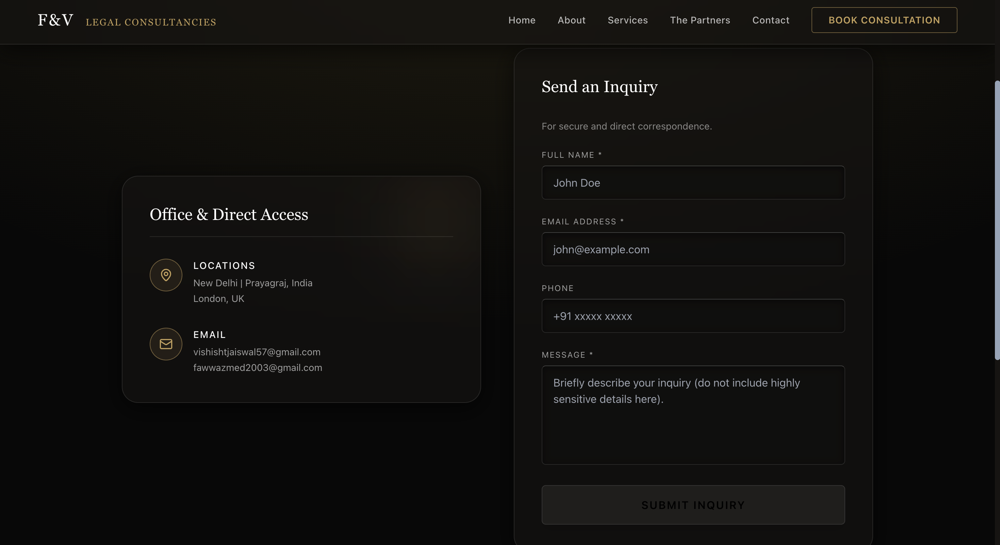
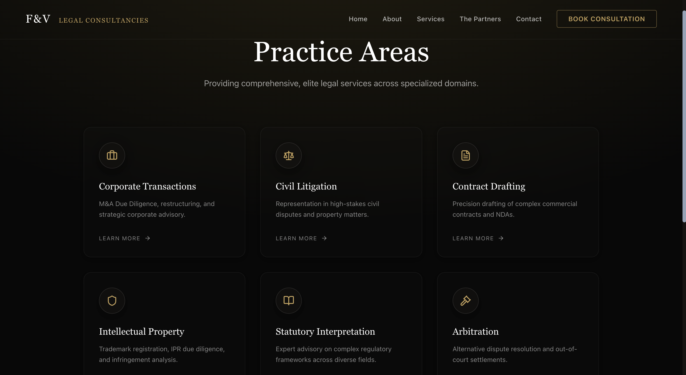

# Legal Consultancy Full Stack Website

A premium, high-performance legal consultancy platform featuring a public-facing client UI, a secure REST API backend (MySQL), and a private Admin Dashboard.

---

## 📸 Admin Portal Snapshots

*(Drag and drop your screenshots here when uploading to GitHub)*

### 1. Dashboard Overview


### 2. Consultations Management


### 3. Contact Inquiries Inbox


---

## 📁 Project Structure

```
legal-consultancy-full-stack-website/
├── frontend/          ← Main public website (Next.js 14)
├── server/            ← REST API server (Express + MySQL + PM2)
└── admin/             ← Admin dashboard (Next.js 14, protected)
```

## 🚀 Local Development Setup

### Prerequisites
- Node.js 18+
- MySQL Server (running on default port `3306`)

### 1. Clone & Install

```bash
git clone <your-repo-url>
cd "legal-consultancy-full-stack-website"

# Install all workspace dependencies at once
npm install
```

### 2. Configure Environment Variables

**server/.env**
```env
DB_HOST=localhost
DB_PORT=3306
DB_NAME=fv_legal_db
DB_USER=root
DB_PASSWORD=your_mysql_password

ADMIN_EMAIL=admin@fvlegal.com
ADMIN_PASSWORD=root123
JWT_SECRET=your_secure_jwt_secret_key

FRONTEND_URL=http://localhost:3000
ADMIN_URL=http://localhost:4000
PORT=5001
```

**frontend/.env.local**
```env
NEXT_PUBLIC_API_URL=http://localhost:5001
```

**admin/.env.local**
```env
NEXT_PUBLIC_API_URL=http://localhost:5001
```

### 3. Run the Development Server

Start all three services concurrently:
```bash
npm run dev
```

Visit:
- **Public website**: http://localhost:3000
- **Admin portal**: http://localhost:4000/login
- **Backend API**: http://localhost:5001/api/health

---

## 🔒 Production Deployment (PM2)

This project is configured for seamless production deployment using PM2 process orchestration. 
We have implemented **Helmet** for security headers and **Express-Rate-Limit** for DDoS protection.

### 1. Build the Applications
```bash
npm run build
```
*(This builds optimized production bundles for Frontend, Admin, and Server simultaneously).*

### 2. Start the PM2 Ecosystem
```bash
npm start
```
This command runs `ecosystem.config.js` and daemonizes all three applications in the background.

### 3. Manage PM2
- `npx pm2 status` — View memory and CPU usage
- `npx pm2 logs` — View real-time logs across all services
- `npm run stop` — Stop the servers
- `npm run restart` — Restart the servers

---

## 🗃️ Database Architecture (MySQL)

The backend uses **Sequelize ORM** to manage the MySQL database automatically. Simply provide your MySQL credentials in the `.env` file and the server will automatically create and sync the tables (`consultations`, `contacts`, `users`).

### Features:
- **Dynamic Status Updates**: Admins can change consultation statuses directly from the dashboard (Pending -> Confirmed -> Completed -> Cancelled).
- **Auto-Sync**: The database schema automatically updates safely without manual migration scripts.

---

## 🛡️ Security Notes
- `helmet` secures all HTTP headers.
- `express-rate-limit` prevents brute-force attacks on API routes (100 requests / 15 mins).
- JWT Authentication secures the admin panel (24-hour expiration).
- **CRITICAL:** Do NOT commit your `.env` files. The `.gitignore` at the root protects your keys.
