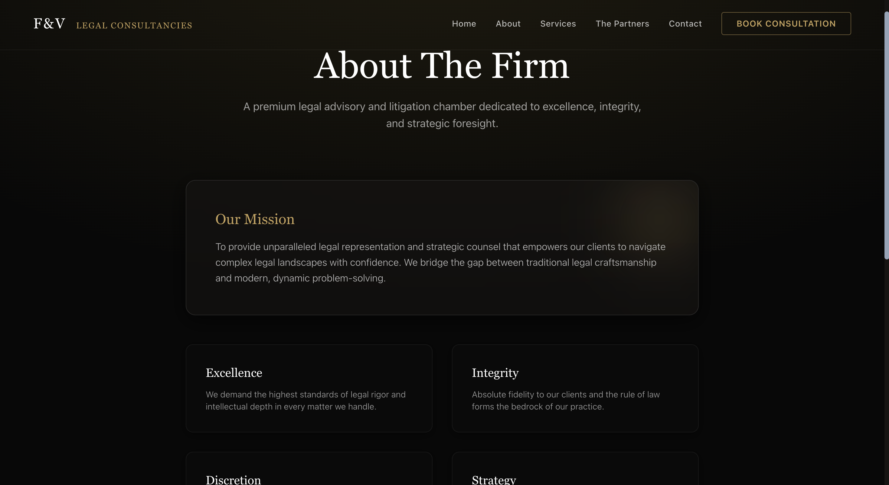

# F&V Legal Consultancies

A premium, high-performance legal consultancy platform featuring a modern client-facing website and a secure private admin dashboard.

---

## 📸 Platform Previews

*(Drag and drop your 5 screenshots below when uploading to GitHub)*

### 1. Home Page (Client UI)


### 2. About The Firm (Client UI)


### 3. Dashboard Overview (Admin Portal)


### 4. Consultations Management (Admin Portal)


### 5. Contact Inquiries Inbox (Admin Portal)


---

## 📁 Repository Structure

This repository focuses on the User Interface (UI). All sensitive backend logic, environment variables, database keys, and node modules have been completely hidden and excluded from this repository to ensure maximum security.

```
/
├── frontend/          ← Main public website (Next.js 14)
└── admin/             ← Admin dashboard (Next.js 14)
```

## 🚀 How to Host on Vercel

Since this repository contains the secure UI, hosting it is incredibly straightforward. Vercel is the recommended hosting platform for Next.js applications.

### 1. Deploy the Public Website
1. Log into [Vercel.com](https://vercel.com) and click **Add New Project**.
2. Import this GitHub repository.
3. **Crucial Step:** In the Vercel configuration, set the **Root Directory** to `frontend`.
4. Click **Deploy**.

### 2. Deploy the Admin Dashboard
1. Go back to the Vercel dashboard and click **Add New Project** again.
2. Import the exact same GitHub repository.
3. **Crucial Step:** In the Vercel configuration, set the **Root Directory** to `admin`.
4. Click **Deploy**.

*Your client website and your private admin portal will now be hosted on two separate, fast, and secure URLs.*

---

## 🛠️ Local Development Setup

If you wish to run the UI locally on your machine:

1. Clone this repository.
2. Open your terminal and navigate to the UI folder you want to run (e.g., `cd frontend`).
3. Run `npm install` to download the packages locally.
4. Run `npm run dev` to start the development server.
5. Open `http://localhost:3000` in your browser.
